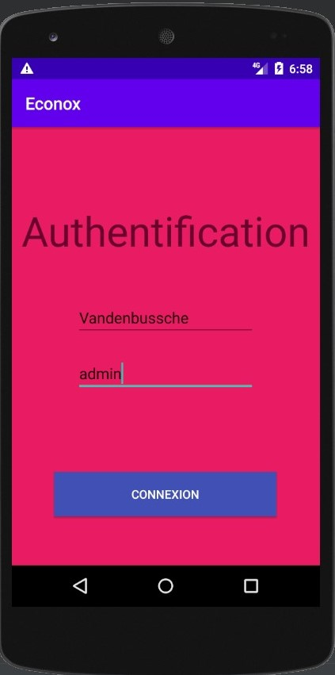

# Projet de fin de deuxième année de BTS 
## Application mobile pour l'entreprise Econox
>Cette application Android permet l'optimisation des collectes de vêtements.
>
>Après s'être authentifié, l'utilisateur récolte les données d'un contenaire de vêtements (id, volume, numéro de téléphone associé et le niveau de la batterie du contenaire).
>
>Il peut ensuite envoyer ces données dans une BDD locale (SQLite) et dans une base distante.
  
	
